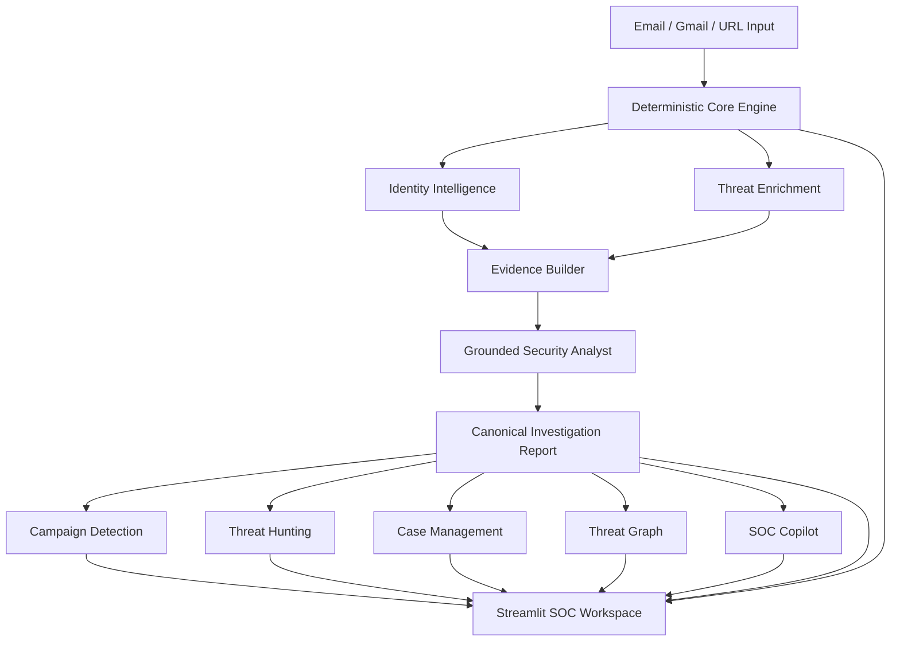

# MailScope AI

**AI-Assisted Email Threat Detection & SOC Investigation Platform**

### [Try MailScope AI Live](https://mailscope-ai.onrender.com)

No installation is required for the hosted portfolio demo. The free hosting instance may require a short cold start after a period of inactivity.

MailScope AI is a cybersecurity portfolio project for analyzing suspicious emails and URLs and turning security evidence into a structured SOC investigation workflow.

It combines deterministic phishing detection, identity intelligence, threat enrichment, evidence-grounded analysis, campaign correlation, threat hunting, case management, threat graphs, and a grounded SOC Copilot.

> AI assists the analyst. It does not override deterministic security evidence or invent unsupported conclusions.

## Key Capabilities

- Email and suspicious URL analysis
- Gmail integration through OAuth
- SPF, DKIM, DMARC, and ARC analysis
- Attachment security analysis
- Brand and impersonation detection
- Organization and domain intelligence
- DNS, RDAP, certificate, IP, and ASN intelligence
- VirusTotal and ThreatFox enrichment
- Evidence-grounded investigation reports
- IOC extraction
- MITRE ATT&CK mapping
- Campaign detection
- Historical threat hunting
- Case management
- Threat relationship graphs
- Grounded SOC Copilot
- Investigation exports

## SOC Investigation Workspace

MailScope AI provides a Streamlit-based SOC workspace containing:

- Executive Assessment
- Findings
- Evidence
- Identity Intelligence
- Indicators of Compromise
- Campaign Detection
- Case Management
- Threat Graph
- SOC Copilot
- MITRE ATT&CK
- Timeline
- Defensive Actions

## Architecture



The hosted architecture uses Streamlit as the public interface and FastAPI as the internal application backend.

## Security and Trust Model

MailScope AI deliberately separates deterministic security decisions from AI-assisted interpretation.

Core principles:

- Unknown identity does not automatically mean phishing.
- Registration information is not proof of legitimacy.
- Shared hosting is context, not proof of malicious activity.
- Threat-intelligence results are evidence, not automatic verdicts.
- Identity conflicts alone do not establish malicious intent.
- Historical correlation does not prove common threat-actor attribution.
- AI cannot override the deterministic Core Engine.
- AI findings must be grounded in supplied evidence.
- Unsupported threat-actor attribution is refused.
- Credentials and OAuth tokens must remain outside source control.

## Detection Philosophy

MailScope AI uses corroboration rather than isolated signals.

For example:

```text
Unknown organization != phishing
```

A combination such as brand impersonation, credential-oriented language, suspicious infrastructure, and additional corroborating evidence can produce a stronger phishing assessment.

This approach is intended to reduce false positives caused by treating ordinary infrastructure characteristics as malicious by themselves.

## Threat Intelligence

MailScope AI can normalize evidence from sources and services such as:

- DNS
- RDAP
- Certificate Transparency
- IP / ASN intelligence
- VirusTotal
- ThreatFox
- Organization intelligence
- Global entity registries
- Official-domain evidence

Provider failures or unavailable enrichment sources are handled as unavailable evidence rather than automatically increasing phishing risk.

External API keys are optional. The platform can operate without paid AI APIs through its deterministic analyst provider.

## Grounded Security Analyst

MailScope AI includes an analyst-assistance layer designed around evidence grounding.

The default zero-cost implementation uses:

```text
mock:deterministic-mock-analyst-v1
```

Security facts are produced by deterministic analysis and evidence-building components. The analyst layer explains and organizes supplied evidence rather than independently inventing security facts.

Grounding controls reject unsupported evidence references and uncited findings.

## Campaign Detection

Campaign Detection correlates historical investigations using supported observables, including:

- SHA-256
- SHA-1
- MD5
- URLs
- Email addresses
- Domains
- IP addresses

Correlation is deterministic.

A shared IP address, cloud provider, CDN, or common hosting platform is not treated as proof that two investigations belong to the same attacker.

MailScope AI does not perform unsupported threat-actor attribution.

## Threat Hunting

Threat Hunting allows analysts to search previous investigation reports using normalized observables.

The hunting system:

- Searches existing investigation evidence
- Does not rerun phishing detection
- Does not invoke AI to manufacture relationships
- Does not modify existing investigation verdicts
- Treats historical matches as shared evidence rather than proof of attribution

## Case Management

Case Management provides a lightweight SOC workflow for grouping and tracking investigations.

Supported workflow elements include:

- Case creation
- Investigation association
- Analyst notes
- Case status updates
- Historical retrieval

Case-management state does not alter the original investigation verdict.

## Threat Graph

The Threat Graph represents evidence-backed relationships between investigation artifacts.

Graph relationships are deterministic and are derived from supported observables rather than inferred attacker identity.

## SOC Copilot

SOC Copilot provides grounded assistance for questions such as:

- What evidence supports the verdict?
- What indicators were identified?
- What related activity exists?
- What defensive actions are recommended?
- How could this activity be detected?
- What should be included in an escalation summary?

SOC Copilot refuses questions that require unsupported facts or attribution.

For example, if the investigation does not contain evidence identifying an attacker, it will not invent one.

## Gmail Integration

MailScope AI includes optional Gmail integration using Google's OAuth flow.

The application can still be demonstrated without Gmail by analyzing URLs and investigation data directly.

For self-hosted Gmail use, each user or organization should provide its own Google OAuth configuration.

Never commit credential material such as:

```text
credentials.json
credentials.json.*
token.json
token.json.*
token.*.json
*.oauth.json
```

OAuth credentials are deployment-specific secrets and should remain outside source control.

## Local Installation

MailScope AI was developed and tested with Python 3.12.

Clone the repository:

```bash
git clone <REPOSITORY_URL>
cd mailscope-ai
```

Create and activate a virtual environment:

```bash
python3.12 -m venv .venv
source .venv/bin/activate
```

Install dependencies:

```bash
pip install -r requirements.txt
```

Create the local environment file:

```bash
cp .env.example .env
```

Start MailScope AI:

```bash
./run_app.sh
```

Local services:

```text
Dashboard:
http://127.0.0.1:8501

FastAPI:
http://127.0.0.1:8000

API documentation:
http://127.0.0.1:8000/docs
```

Stop the application with:

```bash
./stop_app.sh
```

Check status with:

```bash
./status_app.sh
```

## Cloud Deployment

A cloud-compatible launcher is included:

```bash
./start_cloud.sh
```

It starts FastAPI internally on:

```text
127.0.0.1:8000
```

and exposes Streamlit on the hosting platform's assigned `$PORT`.

A Render Blueprint configuration is included in:

```text
render.yaml
```

The hosted deployment is intended for portfolio demonstration and evaluation rather than enterprise production use.

## Environment Configuration

Example configuration is provided in `.env.example`:

```env
APP_NAME=MailScope AI
APP_ENV=development
DATABASE_URL=sqlite:///./phishing_detector.db
GOOGLE_CREDENTIALS_FILE=credentials.json
MODEL_PATH=training/models/phishing_model.joblib
```

Do not place secrets in `.env.example`.

Local `.env` files must remain outside source control.

## Testing

The current release regression result is:

```text
497 passed
0 failed
```

Run the full suite with:

```bash
PYTHONPATH="$PWD" python -m pytest -q
```

The regression suite covers major areas including:

- URL detection
- Identity-aware policy
- Domain and organization intelligence
- DNS
- RDAP
- Certificate Transparency
- IP / ASN intelligence
- ThreatFox
- VirusTotal
- Email authentication
- BEC guardrails
- Attachment analysis
- Gmail workflows
- Analyst grounding
- Threat enrichment
- Campaign detection
- Threat hunting
- Case management
- Threat graph
- SOC Copilot

## Example Investigation

A legitimate control URL used during development is:

```text
https://research.microsoft.com/
```

A structurally suspicious test URL used during development is:

```text
https://microsoft-login.pages.dev/
```

Potentially suspicious URLs should be treated as strings for analysis. Do not manually visit malicious or suspicious URLs simply to test the platform.

## Data and Persistence

The current portfolio architecture uses SQLite for local persistence.

Depending on the hosting environment, filesystem storage in the hosted demonstration may be temporary. The public deployment should therefore be considered a demonstration environment rather than a durable incident-management system.

Production-grade persistent databases and multi-user storage are part of future enterprise deployment work.

## Current Limitations

MailScope AI is a security analysis platform and cannot guarantee that an email or URL is safe or malicious.

Important limitations include:

- Detection can produce false positives and false negatives.
- External enrichment providers may be unavailable, rate-limited, or incomplete.
- Unknown identity is intentionally neutral unless corroborating evidence exists.
- Threat-intelligence observations are contextual evidence rather than automatic verdicts.
- The deterministic SOC analyst does not replace human analyst judgment.
- The portfolio architecture uses SQLite and is not designed for high-availability enterprise workloads.
- Public Gmail OAuth deployment may require additional Google verification, consent, privacy, domain, or security requirements depending on the requested scopes.

High-impact conclusions should be validated using additional security controls and organizational context.

## Enterprise Future Work

Enterprise productionization is intentionally outside the scope of the initial portfolio release.

Future work may include:

- Multi-user authentication
- Role-based access control
- Centralized secrets management
- Enterprise audit logging
- SIEM and SOAR integrations
- Managed databases
- Task queues and scalable workers
- Cloud-native deployment
- Centralized observability
- High availability
- CI/CD pipelines
- Organization-wide Google Workspace integration
- Production data-retention controls
- Compliance controls
- Enterprise security hardening

These capabilities are future deployment work and are not prerequisites for demonstrating the MailScope AI investigation architecture.

## Responsible Use

MailScope AI is intended for:

- Defensive cybersecurity
- Security education
- Authorized security research
- SOC investigation
- Phishing analysis

Do not use MailScope AI to access accounts, systems, email, or infrastructure without authorization.

Use controlled test data and isolated environments when handling potentially malicious content.

## Project Status

The advanced SOC feature set for the initial public portfolio release is complete.

Major release modules include:

- Unified Threat Intelligence
- Campaign Detection
- Threat Hunting
- Case Management
- Threat Graph
- SOC Copilot

The project is currently in public-release and deployment preparation.

## Security

See [SECURITY.md](SECURITY.md) for credential handling, vulnerability reporting, safe testing, and security guidance.

## License

MailScope AI is released under the [MIT License](LICENSE).
